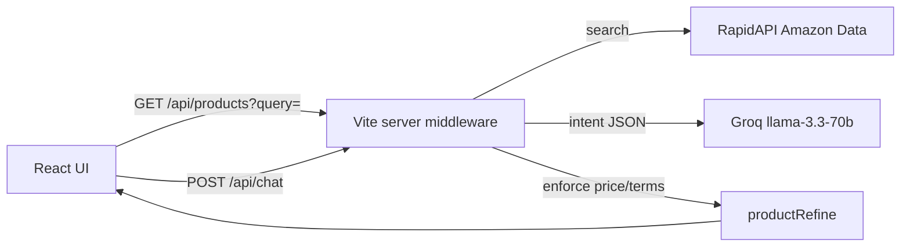

# ShopGPT

Natural-language shopping assistant for discovering Amazon products.

Search or chat in plain English (“gaming monitor under $800”), browse ranked results with ratings, save favorites, and jump to the real Amazon listing.

> Clone-and-run project — not a hosted app. Add your own API keys locally.


## Features

- **Homepage search** — query Amazon via RapidAPI
- **Ask ShopGPT chat** — Groq turns natural language into a search + price constraints, then refines results in code
- **Product cards** — image, price, star rating, favorites heart, **Take me there** (Amazon PDP)
- **Favorites** — saved locally in `localStorage`

## Architecture



Local API routes are Vite middleware plugins under `server/` (not bundled into the client). Secrets stay in `.env` on the Node process.

| Path | Role |
| --- | --- |
| `GET /api/products` | Amazon product search |
| `POST /api/chat` | Groq intent → Amazon search → server-side refine |

## Setup

### 1. Prerequisites

- Node.js 20+ recommended
- [Groq API key](https://console.groq.com/)
- [RapidAPI key](https://rapidapi.com/) subscribed to **[Real-Time Amazon Data](https://rapidapi.com/letscrape-6bRBa3QguO5/api/real-time-amazon-data)**

### 2. Install

```bash
git clone https://github.com/shaurya10n/shopgpt.git
cd shopgpt
npm install
```

### 3. Environment

```bash
cp .env.example .env
```

Edit `.env`:

```env
GROQ_API_KEY=...
RAPIDAPI_KEY=...
```

`.env` is gitignored. Never commit real keys.

### 4. Run

```bash
npm run dev
```

Open the URL Vite prints (usually `http://localhost:5173`).

On startup, missing keys are logged as a warning. Searching/chatting without keys returns a clear UI error.

## Scripts

| Command | Description |
| --- | --- |
| `npm run dev` | Local app + API middleware |
| `npm run build` | Production client build |
| `npm run preview` | Preview build (API middleware included) |
| `npm test` | Unit tests (Vitest) |
| `npm run lint` | Oxlint |

## Usage tips

- Prefer **chat or homepage search** — there is no “browse all” to avoid wasteful API calls
- RapidAPI free tiers rate-limit quickly (`Too many requests`) — wait and retry
- Price phrases like “under $800” are enforced in `server/productRefine.js` even if the model is imprecise

## Project layout

```
src/           React UI (pages, components, context)
server/        Vite middleware: Amazon client, Groq chat, refine helpers, tests
docs/          Extra documentation / screenshot placeholders
.env.example   Required environment variables
```

## Tradeoffs

- **RapidAPI vs scraping** — avoids brittle HTML scrapers and ToS risk; depends on third-party quota
- **Vite middleware vs separate backend** — simplest clone-and-run DX; easy to extract `server/` into Express later
- **Favorites in localStorage** — no auth required for a local demo

## License

MIT — use and adapt for portfolio / learning.
